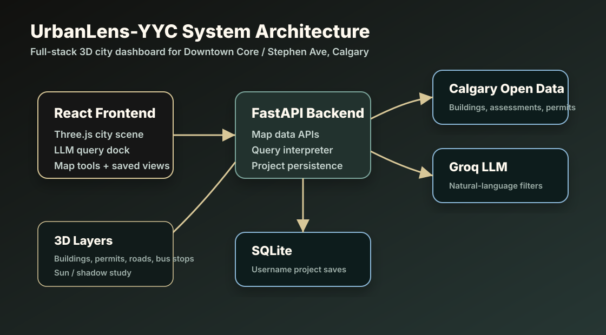
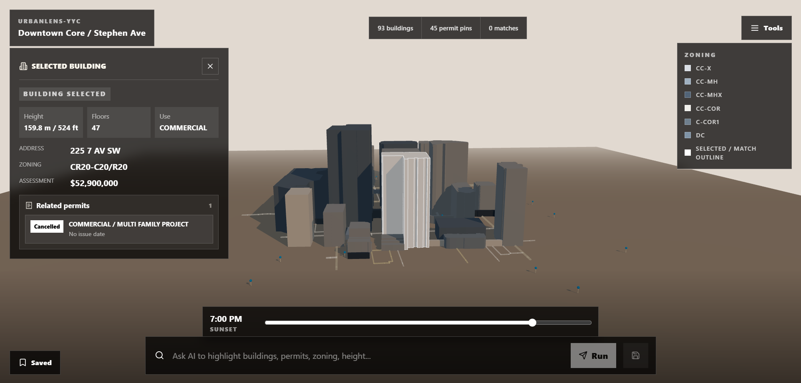
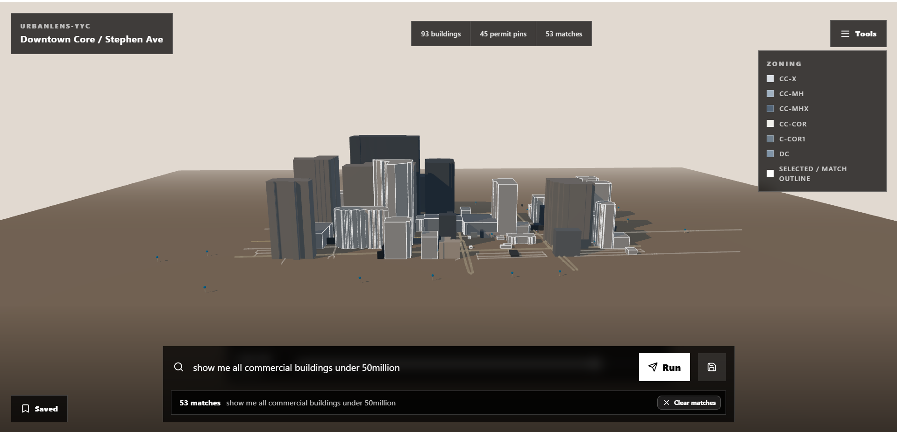

# UrbanLens-YYC

UrbanLens-YYC is a full-stack 3D Calgary city dashboard for the MASIV Fall 2026 intern test.


The target product is an interactive React + Three.js map of several Calgary blocks with:

- extruded building footprints
- clickable building details
- Calgary building permit markers
- cached OpenStreetMap road centerlines
- bus stop context markers
- natural-language LLM filtering
- manual building filters
- username-based project save/load
- lightweight downtown insight summaries
- 24-hour sun, shadow, and day/night study
- UML and deployment documentation

The current map area is **Downtown Core / Stephen Ave, Calgary AB**.

## Live Demo

- Frontend: [https://urban-lens-yyc.vercel.app](https://urban-lens-yyc.vercel.app)
- Backend API: [https://urbanlens-yyc-api-production.up.railway.app](https://urbanlens-yyc-api-production.up.railway.app)
- API status: [https://urbanlens-yyc-api-production.up.railway.app/api/status](https://urbanlens-yyc-api-production.up.railway.app/api/status)

## Repository Map

```text
backend/                  FastAPI app, data normalization, SQLite persistence, tests
frontend/                 React, Three.js scene, map controls, saved search UI
docs/assets/              UML export, architecture visual, product screenshots
docs/assignment-brief.md  Parsed assignment requirements used for implementation
docs/requirements-checklist.md
docs/screenshots.md       Labeled screenshot index for reviewers
docs/architecture-decisions.md
docs/future-improvements.md
```

## Planning Docs

- [Assignment brief](docs/assignment-brief.md)
- [Implementation blueprint](docs/implementation-blueprint.md)
- [Requirements checklist](docs/requirements-checklist.md)
- [Architecture decisions](docs/architecture-decisions.md)
- [Screenshots guide](docs/screenshots.md)
- [Future improvements](docs/future-improvements.md)
- [Reviewer one-pager](docs/reviewer-one-pager.md)
- [Demo script](docs/demo-script.md)
- [UML diagrams](docs/uml.md)
- [Static UML export](docs/assets/uml-export.svg)
- [Submission guide](docs/submission-guide.md)
- [Deployment checklist](docs/deployment-checklist.md)

## Architecture



## Product Screenshots

### 1. 3D Map Overview

Shows the Downtown Core / Stephen Ave study area, 93 extruded buildings, permit pins, zoning legend, sun slider, and natural-language query dock.


### 2. Building Inspection

Shows selected-building highlighting, height in metres and feet, floors, land use, zoning, assessment value, and related permits.



### 3. Query Results

Shows a natural-language query result with matched-building outlines, match count, and a clear action to reset highlights.



## Local Setup

### Backend

```bash
cd backend
python -m venv .venv
.venv\Scripts\activate
pip install -r requirements.txt
python scripts/build_cache.py
uvicorn app.main:app --reload
```

The API runs at `http://localhost:8000`.

### Frontend

```bash
cd frontend
npm install
npm run dev
```

The app runs at `http://localhost:5173`.

## Environment Variables

Backend variables are defined in `backend/.env.example`:

```text
APP_NAME=UrbanLens-YYC API
ENVIRONMENT=development
FRONTEND_ORIGINS=http://localhost:5173,http://127.0.0.1:5173
DATABASE_URL=sqlite:///./urbanlens.db
GROQ_API_KEY=
GROQ_MODEL=llama-3.3-70b-versatile
```

Frontend variables are defined in `frontend/.env.example`:

```text
VITE_API_URL=http://localhost:8000
```

Do not commit `.env` files. For production, set `GROQ_API_KEY`, `DATABASE_URL`, and `FRONTEND_ORIGINS` in the backend host, and set `VITE_API_URL` in the frontend host.

## Deployment

Backend:

- Render can use `render.yaml`.
- Railway can use `backend/Dockerfile`; set the Railway service root directory to `backend`.
- Set `GROQ_API_KEY` as a secret environment variable.
- Set `FRONTEND_ORIGINS` to `https://urban-lens-yyc.vercel.app`.
- Use `/health` and `/api/status` as smoke checks after deployment.

Frontend:

- Vercel can use `frontend/vercel.json`.
- Set `VITE_API_URL` to `https://urbanlens-yyc-api-production.up.railway.app`.
- After deployment, run a query and load/save a project to confirm frontend-backend connectivity.

## Current Status

Built:

- FastAPI backend with health, map data, query, filter, and project endpoints
- cached Calgary building, permit, and OpenStreetMap road datasets
- parcel-matched Calgary assessment values with unknown values shown when no parcel match is available
- deterministic query fallback for height, zoning, land use, value, and superlatives
- SQLite-backed username/project persistence
- React + Three.js frontend with 3D buildings, permit pins, bus stops, query controls, matched results, manual filters, saved projects, and downtown insights
- optional 24-hour sun study with day/night lighting and shadows

## Demo Workflow

1. Open the frontend at `http://localhost:5173`.
2. Run a natural-language query from the bottom input, such as `show commercial buildings`.
3. Review the match count, parsed filter summary, and highlighted buildings on the map.
4. Use the matched building list to inspect addresses, zoning, height, and assessment values.
5. Click a building or permit marker to update the selected details panel.
6. Save the current query as a named project under a username.
7. Load the saved project to reapply its filters and restore the highlighted results.

## Key API Endpoints

```text
GET  /health
GET  /api/status
GET  /api/map/buildings
GET  /api/map/permits
POST /api/query
POST /api/filter
GET  /api/users/{username}/projects
POST /api/users/{username}/projects
GET  /api/users/{username}/projects/{project_id}
DELETE /api/users/{username}/projects/{project_id}
```

Example query request:

```json
{
  "query": "show buildings in DC zoning"
}
```

Example filter response shape:

```json
{
  "query": "show buildings in DC zoning",
  "method": "llm",
  "filters": [{ "attribute": "zoning", "operator": "contains", "value": "DC", "unit": null }],
  "matched_building_ids": ["bldg_example"],
  "match_count": 14
}
```

`GET /api/status` is the fastest deployment smoke check. It returns the active map area, building count, permit count, data source, and whether the Groq LLM path is configured without exposing secrets.

Before final handoff:

- use `docs/assets/uml-export.svg` as the UML export or convert it to PDF/PNG
- prepare final ZIP package
