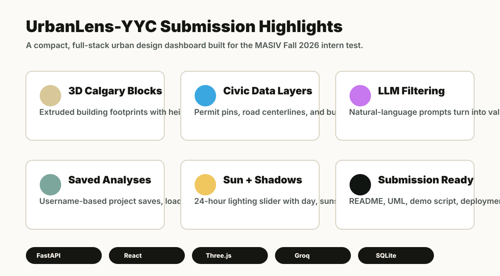
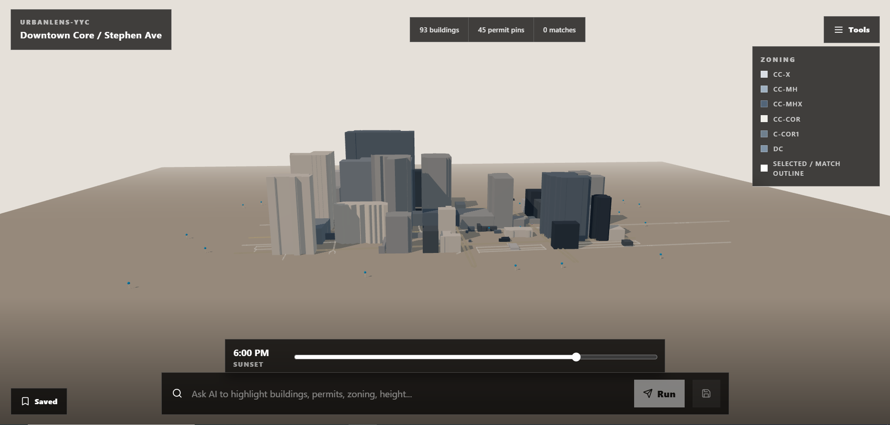

# UrbanLens-YYC Reviewer One-Pager

## What It Is

UrbanLens-YYC is a full-stack 3D urban analysis dashboard focused on Downtown Core / Stephen Ave in Calgary. It combines public city datasets, interactive 3D visualization, natural-language filtering, and project persistence into one working prototype.

## Why It Fits MASIV

- It uses real city geometry and civic data instead of mock-only content.
- It turns a block-level urban design question into an interactive 3D workflow.
- It includes the required live civic data layer through Calgary building permits.
- It adds extra map context with roads, bus stops, and a 24-hour sun/shadow study.
- It demonstrates backend, frontend, persistence, data normalization, and LLM integration.

## Key Demo Moments

1. Load the 3D Downtown Core / Stephen Ave study area.
2. Run `show commercial buildings` or `show buildings over 50 m`.
3. Click a highlighted building to inspect height, floors, zoning, land use, and assessment value.
4. Toggle permit pins and inspect a permit record.
5. Toggle bus stops for civic context.
6. Move the sun slider from morning to night to show lighting and shadows.
7. Save the current filter as a project, reload it, and delete it.

## Technical Stack

- Backend: FastAPI, SQLAlchemy, SQLite, Calgary Open Data, Groq
- Frontend: React, Vite, Three.js, React Three Fiber, Drei
- Data: building footprints, property assessments, building permits, road centerlines, bus stop markers
- Documentation: README, UML source, static UML SVG export, deployment checklist, demo script

## Submission Assets

- Main README: `README.md`
- UML source: `docs/uml.md`
- UML export: `docs/assets/uml-export.svg`
- Architecture visual: `docs/assets/architecture-overview.svg`
- Product screenshots: `docs/assets/screenshot-map-overview.png`, `docs/assets/screenshot-building-details.png`, `docs/assets/screenshot-query-results.png`
- Screenshot guide: `docs/screenshots.md`
- Architecture decisions: `docs/architecture-decisions.md`
- Future improvements: `docs/future-improvements.md`
- Submission checklist: `docs/submission-guide.md`
