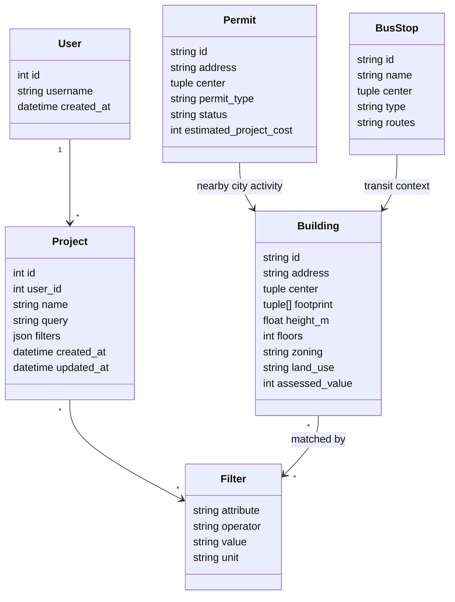
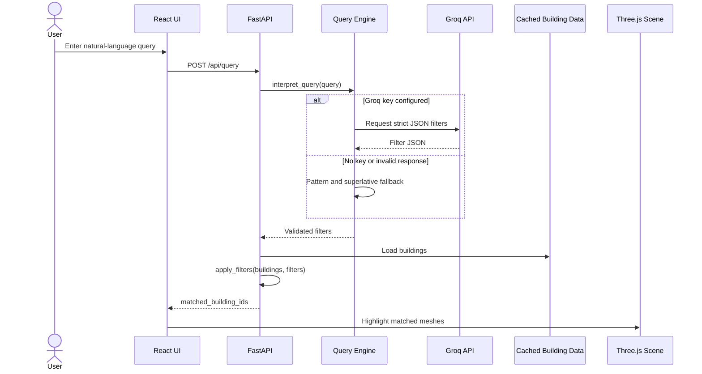
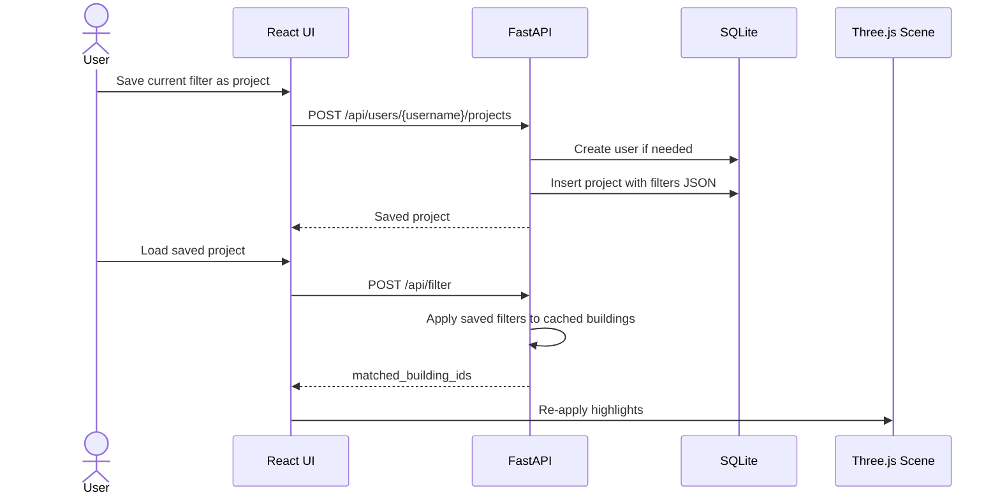
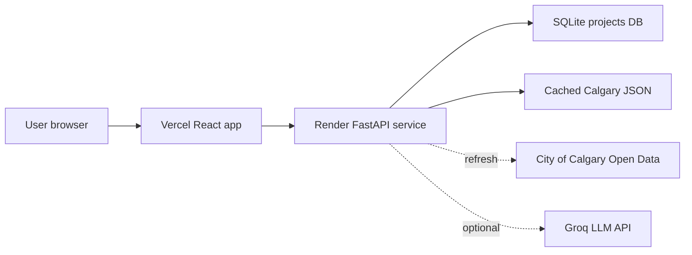

# UrbanLens-YYC UML

## Class / Data Model

```mermaid
classDiagram
  class User {
    int id
    string username
    datetime created_at
  }

  class Project {
    int id
    int user_id
    string name
    string query
    json filters
    datetime created_at
    datetime updated_at
  }

  class Building {
    string id
    string address
    tuple center
    tuple[] footprint
    float height_m
    int floors
    string zoning
    string land_use
    int assessed_value
  }

  class Permit {
    string id
    string address
    tuple center
    string permit_type
    string status
    int estimated_project_cost
  }

  class BusStop {
    string id
    string name
    tuple center
    string type
    string routes
  }

  class Filter {
    string attribute
    string operator
    string value
    string unit
  }

  User "1" --> "*" Project
  Project "*" --> "*" Filter
  Building "*" --> "*" Filter : matched by
  Permit --> Building : nearby city activity
  BusStop --> Building : transit context
```

## Query Sequence

```mermaid
sequenceDiagram
  actor User
  participant UI as React UI
  participant API as FastAPI
  participant Parser as Query Engine
  participant LLM as Groq API
  participant Data as Cached Building Data
  participant Scene as Three.js Scene

  User->>UI: Enter natural-language query
  UI->>API: POST /api/query
  API->>Parser: interpret_query(query)
  alt Groq key configured
    Parser->>LLM: Request strict JSON filters
    LLM-->>Parser: Filter JSON
  else No key or invalid response
    Parser->>Parser: Pattern and superlative fallback
  end
  Parser-->>API: Validated filters
  API->>Data: Load buildings
  API->>API: apply_filters(buildings, filters)
  API-->>UI: matched_building_ids
  UI->>Scene: Highlight matched meshes
```

## Save / Load Sequence

```mermaid
sequenceDiagram
  actor User
  participant UI as React UI
  participant API as FastAPI
  participant DB as SQLite
  participant Scene as Three.js Scene

  User->>UI: Save current filter as project
  UI->>API: POST /api/users/{username}/projects
  API->>DB: Create user if needed
  API->>DB: Insert project with filters JSON
  API-->>UI: Saved project

  User->>UI: Load saved project
  UI->>API: POST /api/filter
  API->>API: Apply saved filters to cached buildings
  API-->>UI: matched_building_ids
  UI->>Scene: Re-apply highlights
```

## Deployment View

```mermaid
flowchart LR
  Browser["User browser"] --> Vercel["Vercel React app"]
  Vercel --> Render["Render FastAPI service"]
  Render --> SQLite["SQLite projects DB"]
  Render --> Cache["Cached Calgary JSON"]
  Render -. refresh .-> Calgary["City of Calgary Open Data"]
  Render -. optional .-> Groq["Groq LLM API"]
```
